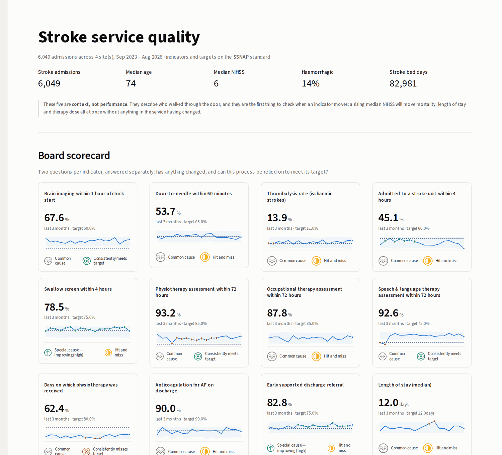
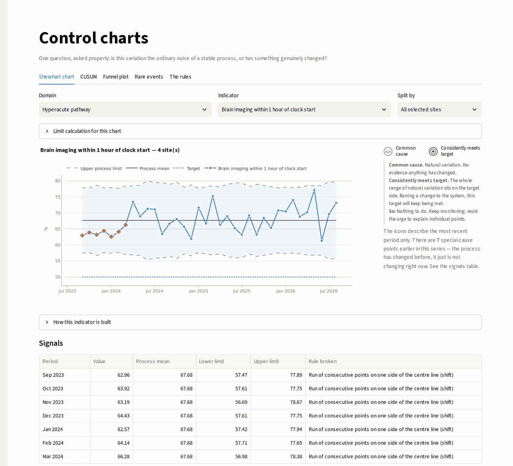
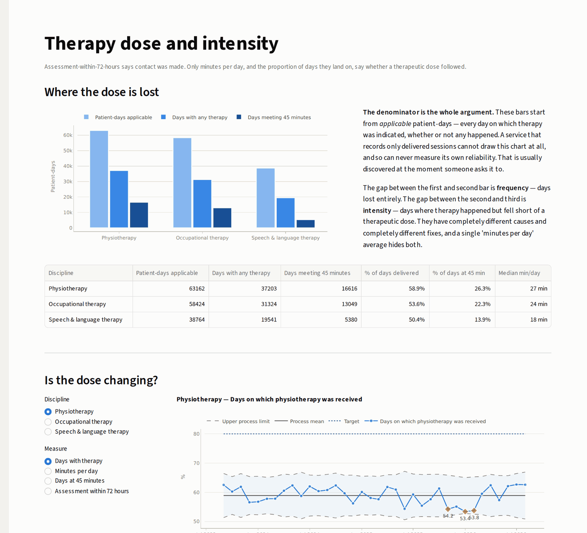
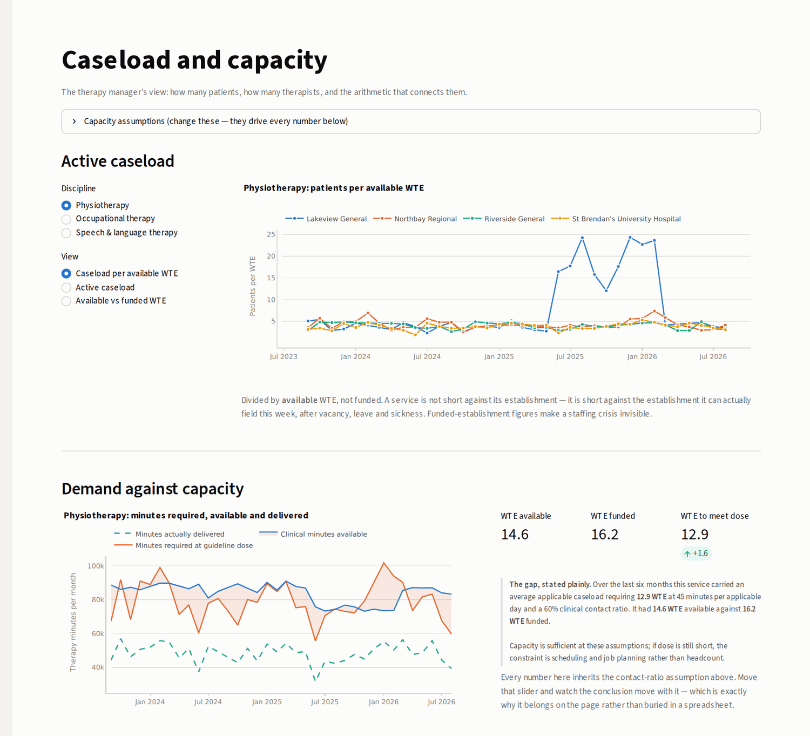
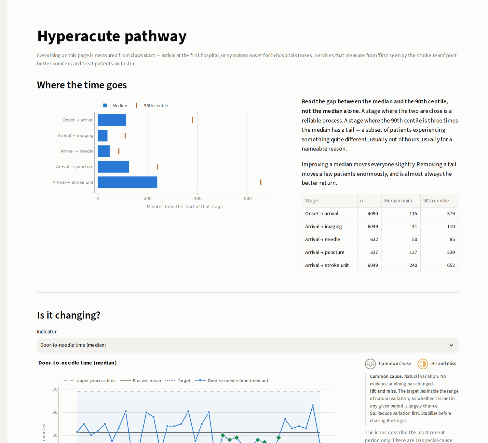
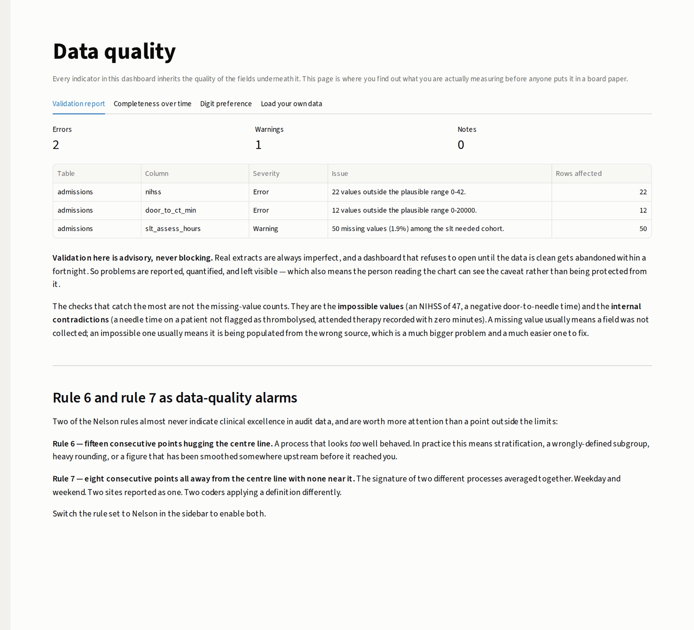

# Stroke Quality Intelligence

[](https://github.com/USERNAME/stroke-quality-dashboard/actions/workflows/ci.yml)
[](https://www.python.org/)
[](https://streamlit.io)

A Streamlit dashboard for stroke service quality improvement: audit indicators on a
switchable SSNAP / Irish national standard, a full statistical process control toolkit
with NHS *Making Data Count* variation and assurance icons, and a therapy layer built
for the PT, OT and SLT services rather than bolted onto a medical dashboard.

**[▶ Live demo](https://USERNAME-stroke-quality-dashboard.streamlit.app)** ·
**[Methods](METHODS.md)** — the statistics, in full

> All data shipped with this app is **simulated**. It is realistic in structure and
> must never be quoted as evidence about any real service.



---

## What it does differently

**1. Separates the indicator from the standard.** How a metric is calculated and what
target it is judged against are different things, owned by different people, changing
on different clocks. Switching between SSNAP-style and Irish national reporting
re-labels and re-targets 39 indicators without touching a line of calculation.

**2. Treats variation properly.** XmR, p and Laney p′, u and u′, c, t and g charts,
funnel plots with overdispersion adjustment, CUSUM, baseline freezing and phase
breaks — with *Making Data Count* variation and assurance icons on every indicator.
No RAG ratings, no month-on-month arrows.

**3. Builds the therapy layer for therapists.** PT, OT and SLT get dose and frequency
measured against a real denominator of opportunity, missed-session reasons split into
capacity and patient causes, a demand-versus-capacity model with its assumptions on
the page rather than buried, and caseload measured per *available* WTE.

Every statistical choice is explained in the interface itself — each chart carries a
"How this indicator is built" panel with the formulae and the reasons.

---

## Quick start

```bash
git clone https://github.com/USERNAME/stroke-quality-dashboard.git
cd stroke-quality-dashboard
pip install -r requirements.txt
streamlit run app.py
```

First launch generates a simulated three-year, four-site cohort (~6,000 admissions,
~180,000 therapy patient-days) and caches it to `data/` as Parquet. Subsequent
launches are instant.

```bash
pytest tests/ -q      # 154 tests
```

---

## The pages

### Control charts — the workbench

Any indicator, any chart type, with baseline freezing, phase breaks, a change-point
suggester, CUSUM, funnel plots, rare-event t- and g-charts, and the rule sets laid out
side by side.



### Therapy dose — PT, OT and SLT

The dose cascade (applicable days → days delivered → days meeting 45 minutes), the
weekend effect quantified in minutes, time to first assessment, and a dose–outcome
view with the confounding made explicit rather than hidden.



### Caseload and capacity — the therapy manager's view

Caseload per *available* WTE, demand against capacity in minutes, missed-session
Pareto split by cause, waiting time to first delivered session, and vacancy against
establishment. The screenshot below shows a planted physiotherapy vacancy: caseload
per WTE jumps from about 5 to over 30 while the establishment figure barely moves.



### Hyperacute pathway

Where the time goes from clock start, the out-of-hours tail with a Hodges–Lehmann
shift estimate, and the full door-to-needle distribution rather than just the
60-minute threshold.



### Data quality

Validation report, completeness measured *within each field's applicable cohort*,
denominator drift, and a digit-preference check for rounded timings.



### Also

**Service overview** — the board scorecard, indicators sorted into *deteriorating*,
*stable but failing* and *improving*, plus funnel comparison and an mRS shift plot.
**Patient explorer** — drill from a signal down to the records behind it.

---

## Deploying it

The app is a standard Streamlit project and deploys as-is on
[Streamlit Community Cloud](https://share.streamlit.io), free:

1. Push this repo to GitHub.
2. Sign in at [share.streamlit.io](https://share.streamlit.io) with GitHub.
3. **New app** → pick this repo, branch `main`, main file `app.py`.
4. Deploy. It redeploys automatically on every push to `main`.

No secrets, no database and no environment variables are required — the app generates
its own demonstration data on first run.

**If you point it at real data, do not deploy it publicly.** Community Cloud apps have
no authentication. Run it behind your organisation's infrastructure instead; a
`Dockerfile` is a small addition if you need one.

---

## Using your own data

Two files, or two SQL views. Download the template and data dictionary from
**Data quality → Load your own data**, or see `core/loaders.py` for the full schema.

### `admissions` — one row per stroke admission

Key columns: `admission_id`, `site`, `arrival_datetime` (clock start), `age`,
`stroke_type`, `nihss`, `prestroke_mrs`, `door_to_ct_min`, `thrombolysed`,
`door_to_needle_min`, `time_to_su_hours`, `swallow_screen_hours`,
`pt_needed` / `ot_needed` / `slt_needed`,
`pt_assess_hours` / `ot_assess_hours` / `slt_assess_hours`, `los_days`,
`died_inpatient`, `discharge_destination`, `mrs_discharge`.

### `sessions` — one row per **applicable patient-day per discipline**

Not one row per delivered session. This is the single most important modelling choice
in the app.

A table of attendances cannot answer *"on what proportion of days did this patient
receive therapy?"*, because the denominator — days on which therapy should have
happened — is not in it. Services that record only delivered sessions can never
measure their own reliability, and usually discover this at the moment they are asked
to prove it.

So `applicable` must be TRUE for every day therapy was indicated, whether or not it
happened, and `minutes` is 0 on days it did not. `missed_reason` is the field that
separates a capacity problem from a clinical one, and it is worth starting to collect
even if nothing else here changes.

### `staffing` — optional, one row per week per site per discipline

`wte_funded`, `wte_vacant`, `wte_absent`, `wte_available`. Without it everything works
except the caseload and capacity page.

### A note on patient data

`.gitignore` blocks every common extract format outright — `.csv`, `.parquet`,
`.xlsx`, `.sav`, `.dta`, `.sqlite` and more — before the usual Python ignores. This is
deliberate: the failure mode of committing patient data to a public repo is
unrecoverable, because a force-push does not remove a blob from a fork, a clone, or
GitHub's cache. Do not weaken those patterns.

---

## Targets

The thresholds in `core/standards.py` are **sensible working defaults, not a
transcription of any audit's current technical guidance**. National thresholds move.
Before anything from this dashboard reaches a board paper, open the current year's
technical guidance and confirm every value in the `THRESHOLDS` tables. They are
deliberately kept in one place, and are overridable at runtime, so this is a
five-minute job rather than a code change.

Each target carries a `provenance` string, shown in the interface, so a reader can
tell a national threshold from a local working assumption.

---

## Project layout

```
app.py                  router
core/
    standards.py        indicator registry + the switchable target layer
    metrics.py          patient records -> numerators and denominators
    spc.py              the control chart engine
    mdc.py              Making Data Count classification and icons
    synth.py            synthetic cohort with planted special causes
    loaders.py          schema contract, validation, caching
    viz.py              Plotly builders and the palette
    ui.py               shared Streamlit furniture
views/                  one module per page
tests/
    test_spc.py         SPC arithmetic + planted-signal ground truth
    test_viz.py         every figure serialises, including degenerate input
    test_pages.py       every page and every control, via Streamlit's AppTest
```

### Extending it

**Adding an indicator.** Add a boolean `flag_*` (and a `den_*` cohort if it needs a
new one) in `core/metrics.derive_flags`, then a `MetricSpec` and its thresholds in
`core/standards.py`. Nothing else changes — it appears on the scorecard, in the
control chart workbench and in the funnel picker automatically.

**Adding a standard.** Add a key to `THRESHOLDS`. The sidebar picks it up.

**Risk adjustment.** The most valuable extension, and deliberately not included
because it is a modelling commitment rather than a feature. Crude mortality and
functional-outcome comparisons between sites are close to meaningless without it.
`METHODS.md` §10 sets out how to do it and what to watch for.

**Rebranding the charts.** `core/viz.py` holds the palette in `LIGHT` and `DARK`
dicts. Substitute your hues and validate them for colour-vision deficiency before
shipping — do not eyeball it.

---

## Tested against

| Python | numpy | pandas | scipy |
|---|---|---|---|
| 3.11 | 1.26.4 | 2.2.3 | 1.13.1 |
| 3.12 | latest | 2.3.x | latest |
| 3.12 / 3.13 | latest | 3.x | latest |

CI runs the full suite on all four combinations plus a boot check that the app
actually serves, on every push.

---

## The demonstration data

It is constructed, not sampled — a service with a *history*. A thrombolysis pathway
redesign at one site, a period of bed pressure at another, a physiotherapy vacancy at
a third, a falls cluster, a change to swallow screening, plus permanent weekend and
winter effects, and four planted recording defects for the data quality page. The
charts should find all of them, and `tests/test_spc.py` asserts that they do.

Headline rates are calibrated to plausible ranges for a mixed acute stroke population
— in-hospital mortality about 12%, thrombolysis about 12% of ischaemic strokes,
median length of stay 11 days — so the dashboard demonstrates against numbers a
clinician will not immediately reject.

It is simulated. It describes no real service, and no real patient.
